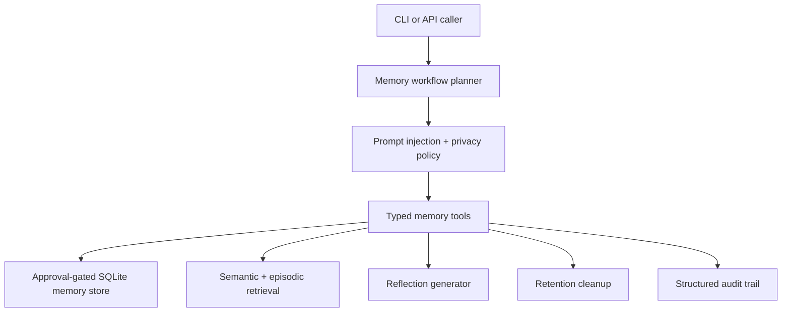

# Self Improving Memory Augmented Agent

Self Improving Memory Augmented Agent stores approved episodic and semantic memories in a local SQLite checkpoint, retrieves them for future prompts, reflects on retention quality, and forgets expired items while rejecting sensitive data.

## Value proposition

- Demonstrates explicit memory checkpoints rather than vague “self-improvement”.
- Separates persistence, retrieval, reflection, and forgetting into typed tools.
- Adds privacy and retention policies before adaptive behavior is allowed.

## Architecture



## Quickstart

```powershell
pwsh .\scripts\bootstrap.ps1
pwsh .\scripts\verify.ps1
pwsh .\scripts\run_demo.ps1
```

## Usage examples

```powershell
python -m self_improving_memory_augmented_agent run "remember semantic retention 30 tags: incident,latency Lead with customer impact for latency incidents." --auto-approve --json-output
python -m self_improving_memory_augmented_agent run "retrieve latency incidents" --json-output
python -m self_improving_memory_augmented_agent run "reflect on latency incidents" --json-output
python -m self_improving_memory_augmented_agent run "forget expired memories" --json-output
```

## Example input and output

Input:

```json
{"prompt":"retrieve latency incidents"}
```

Output summary:

```json
{
  "status": "completed",
  "final_answer": "Retrieved memory guidance: Lead with customer impact and the top suspect for latency incidents."
}
```

## Safety model

- Prompt injection is blocked before memory operations begin.
- Persistent memory writes require explicit approval.
- Sensitive content such as passwords, tokens, and private keys is rejected.
- Retention cleanup deletes expired memories to reduce stale or privacy-risky storage.

## Evaluation approach

- Evals cover purpose grounding, memory persistence, and retrieval.
- Tests validate sensitive-data rejection, forgetting, timeouts, and tool failures.
- The store uses a deterministic local SQLite file in `runtime-output`.

## Limitations

- Retrieval uses lexical relevance rather than embeddings.
- Reflection is rule-based and intentionally modest.
- Multi-user identity separation is not implemented in this local demo.

## Roadmap

- Add pluggable embedding-backed semantic retrieval.
- Add explicit memory review queues and rollback snapshots.
- Add per-tenant privacy policies and scoped retention classes.

## Demo scenarios

- Persist a reviewed lesson learned from an incident.
- Retrieve that lesson to improve a later answer.
- Reflect on retained knowledge quality.
- Delete expired memories according to policy.

## Portfolio explanation

This repo demonstrates serious adaptive-system hygiene: memory only with approval, privacy screening before persistence, and explicit forgetting so “learning” remains reviewable.
