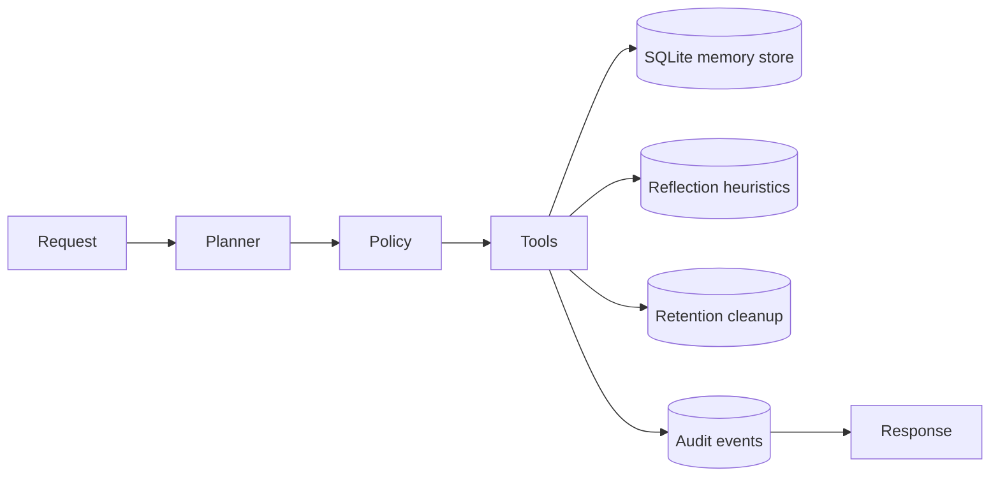

# Architecture

The planner routes prompts into one memory operation at a time. Persisted memory is stored under `runtime-output\memory-store.sqlite3`, while retrieval and reflection operate only on active, unexpired rows.
